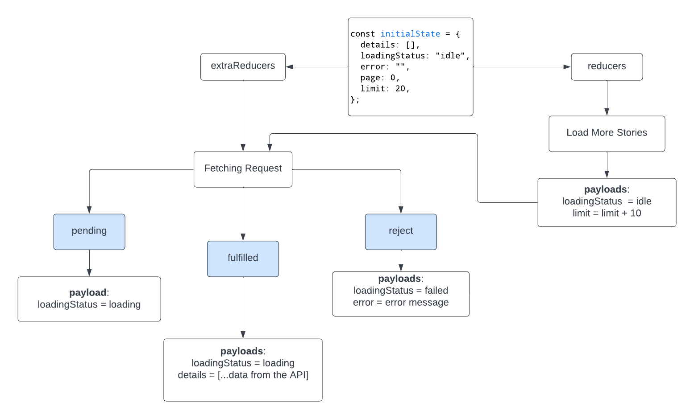

# Hacker News Clone - Next.js

Users can view 8 recent stories of each category, top, show, and job on the home page, and then can browse additional stories on subsequent pages. Each story block can be clicked to view its link and comments.

[View the live site here](https://hacker-news-next.vercel.app/)

**Tech Stack:**

     

## The User stories

- [x] Users should be able to see 8 recent stories of each category on the home page
- [x] Users should be able to view additional stories on subsequent pages
- [x] Users should have the option to load more stories by clicking on the `Load More Stories` at the bottom of the page
- [x] Each story block on each page should include the story title, total points, author name, time since the story was posted, and the total number of comments
- [x] The job page should display story blocks containing the name of the company hiring, the position being advertised, the link to the job listing, the author's name, and the time since the job was posted
- [x] Clicking on each story block should open a modal window displaying the story's link, content (if applicable), and comments
- [x] The modal window may include a `Load More Comments` button at the bottom, allowing users to view additional comments if available

## Screenshot/GIFs

<details close>
<summary>Overall Demo</summary>

https://user-images.githubusercontent.com/35031228/220741504-6ce9e933-f240-41d7-94a8-9f211f38e5e3.mp4

</details>

<hr />

<details close>
<summary>Load More Stories</summary>

https://user-images.githubusercontent.com/35031228/220741439-0a8e4f32-8a66-4448-938a-8d273725e389.mp4

</details>

<hr />

<details close>
<summary>Modal Window (top and show pages)</summary>

https://user-images.githubusercontent.com/35031228/220741470-0d11766f-cd34-4559-a98d-3fc7f2529ba1.mp4

</details>

<hr />

<details close>
<summary>Job Page</summary>

https://user-images.githubusercontent.com/35031228/220741173-16c4b3a7-c187-4bfe-8e50-76db6f65e290.mp4

</details>

<hr />

## Run Locally

```bash
git clone git@github.com:victoriacheng15/hacker-news-next.git
```

```bash
cd hacker-news-next
```

```bash
# or your package manager preference
npm install
```

```bash
npm run dev
```

## What have I learned



**Redux ToolKit**

`CreateAsyncThunk` is a method for managing data retrieval from an API and returning payloads containing information on data, loading status, and errors. By using `extraReducer` from `createSlice`, it can handle the output based on the results of the retrieval process. This process is similar to a switch case where, if the retrieval process is successful, the payload will contain information from the API, the loading status will indicate success, and there will be no errors.

In addition, you can use the `reducers` feature of `createSlice` to handle actions. In this particular case, I utilized `reducers` to manage state changes related to the loading status and limit for loading more stories.

**Chakra UI**

Before using the Chakra UI component library, I didn't have experience with component libraries or similar tools. However, I learned that Chakra UI can significantly speed up the component-building process by providing pre-built components that have a consistent UI, accessibility considerations, and customizable options like color schemes and layouts. Furthermore, the library's `as` props feature allows developers to render components as specific HTML elements, adding to its versatility.

## Author

[](https://www.linkedin.com/in/victoriacheng15/) [](https://twitter.com/viktoriacheng15)
